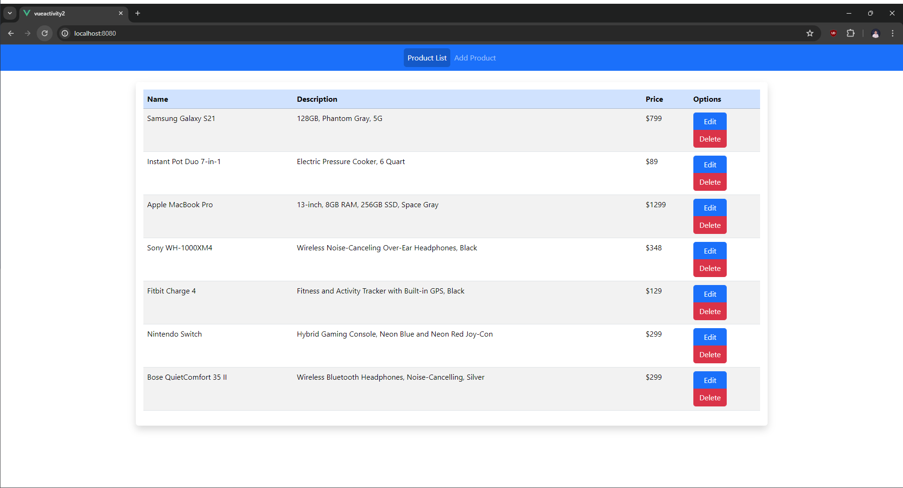
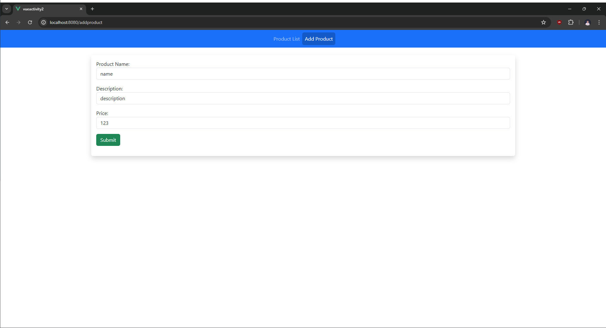
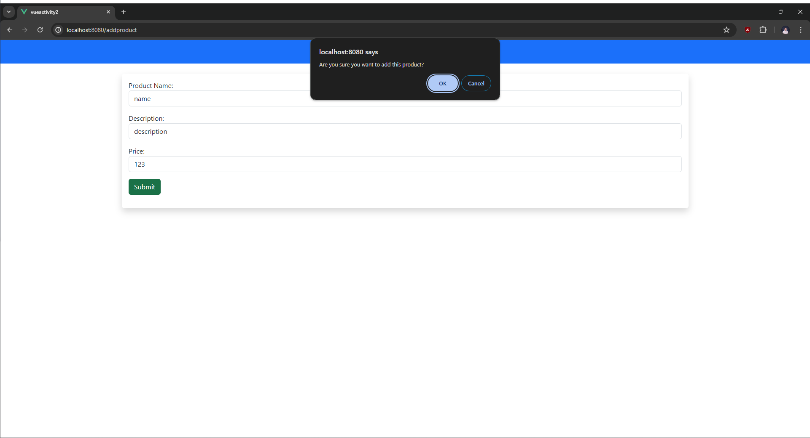
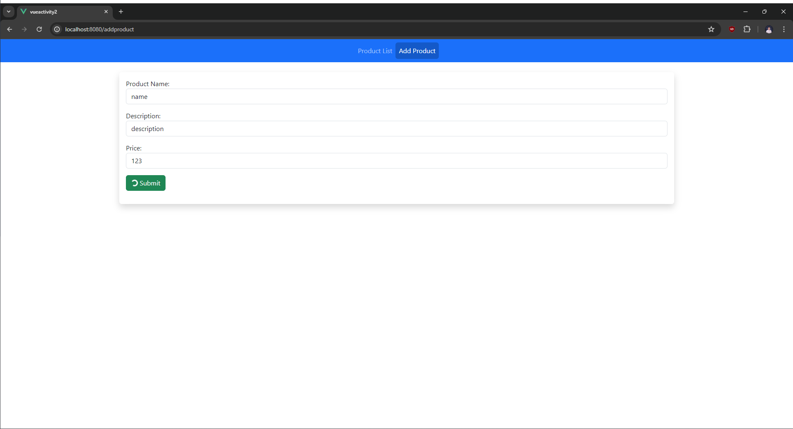
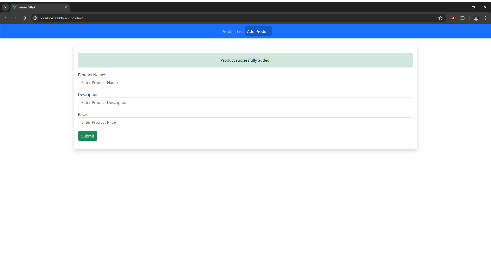
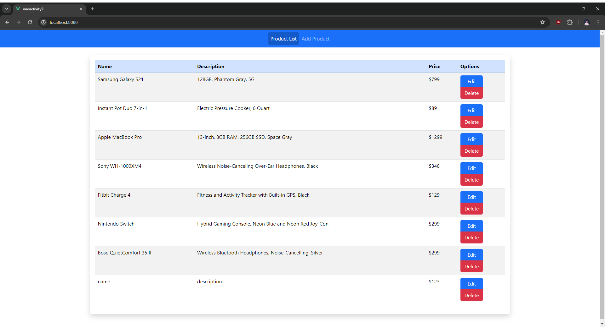
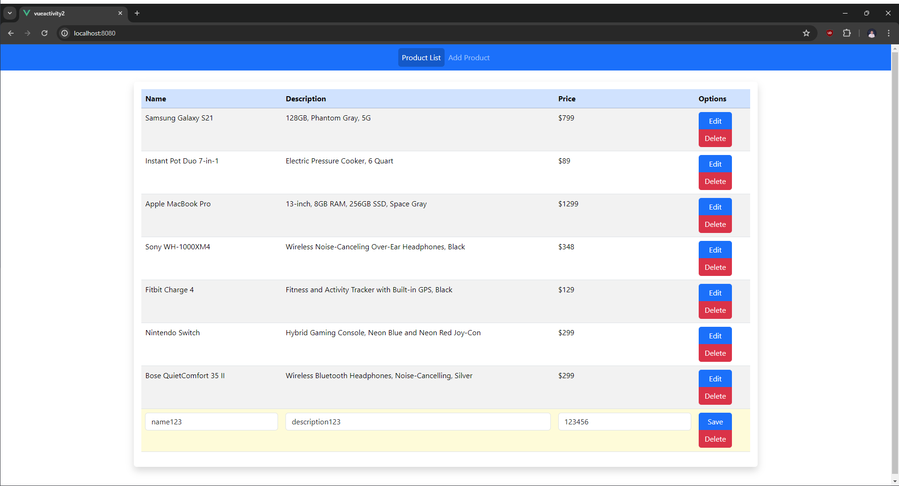
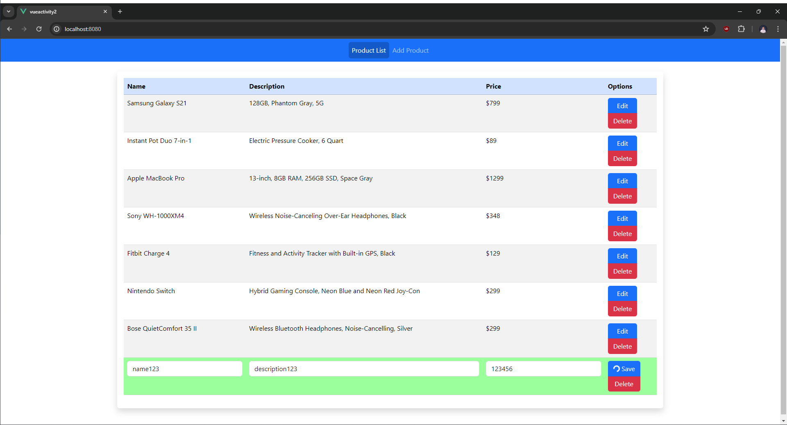
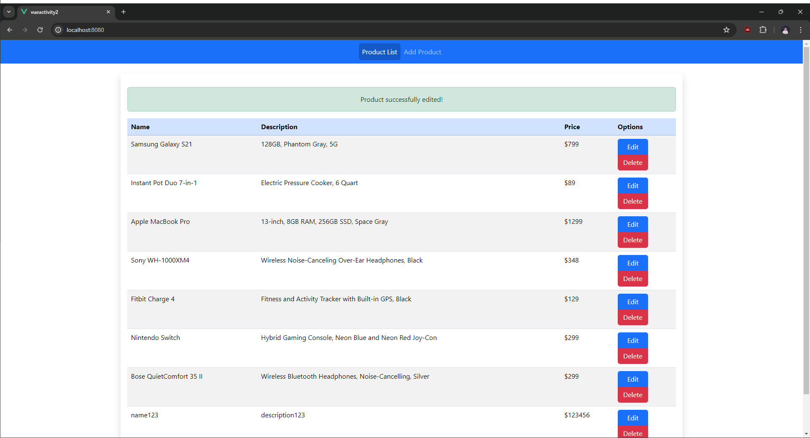

# **Building a Product CRUD App with Vue.js Animations and Vuex**

This lab activity will evaluate your ability to handle forms, animations, and transitions while creating a CRUD (Create, Read, Update, Delete) application for managing products using Vue.js.

## Table of Contents

- [Objectives](#objectives)
- [Tasks](#tasks)
- [Setup](#setup)
- [Screenshots](#screenshots)

## **Objectives:**

-   Develop a multi-page Vue.js application with components.
-   Handle user input for product creation and updates through forms.
-   Implement CRUD operations for product data using array as storage.
-   Utilize animations and transitions to enhance user experience.

## **Tasks:**

Develop a Vue.js application that allows users to manage a list of products. The application should have the following features:

1. **Product List:**

    -   Display a list of products with their name, description, and price.
    -   Utilize Vue components to structure each product entry.

2. **Add Product:**

    -   Provide a dedicated page or section with a form for adding new products.
    -   Capture user input for product name, description, and price.
    -   Save the new product data upon submission to an array as storage.
    -   Apply animation after successful addition.

3. **Edit Product:**

    -   Allow users to edit existing products. This can be:
        -   In-place editing by clicking on a product and displaying editing fields.
        -   Separate edit page for each product accessed through a click action.
    -   Update the product data in storage on user changes.
    -   Implement form validation to ensure proper data entry.
    -   Animate the update of product details when edited.

4. **Delete Product:**

    -   Provide a delete button or action for each product.
    -   Confirm user intent before removing the product.
    -   Remove the product from the data storage.
    -   Animate the removal of the product from the list.
    
## Setup

**Clone the project repository:**

```
    git -c http.sslVerify=false clone https://github.com/vncnthgy/midtermactivity2.git
```

**Go to project directory:**

```
    cd midtermactivity2
```

**Install the project dependencies:**

```
    npm install
```

**Check your current branch:**

```
    git branch --all
```

**Create your own branch:**

```
    git checkout -b branch-name
```

**Run the project:**

```
    npm run serve
```

## Screenshots





















